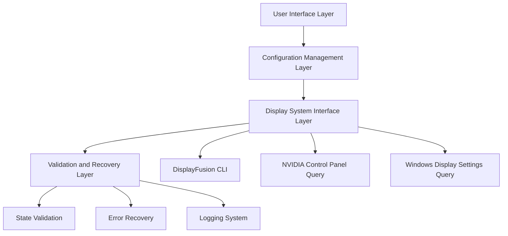

# Design Document: Windows Display Switcher

## Overview

The Windows Display Switcher is a robust batch script solution that leverages DisplayFusion's command-line interface to provide reliable monitor configuration management. The system replaces existing flaky MultiMonitorTool-based scripts with a single, comprehensive solution that handles the user's 3-monitor setup (Left portrait, Center primary landscape, Right landscape).

The design emphasizes reliability through validation, error handling, and fallback mechanisms, addressing the core issues of timing, state detection, and configuration verification that plagued the previous solutions.

## Implementation Status

**Phase 1 Complete**: Core DisplayFusion integration working. Profile switching via CLI is functional.

### Key Discovery: Confirmation Dialog Bypass

DisplayFusion shows a "Do you want to keep this Monitor Configuration?" dialog with a 15-second timeout when profiles are loaded. This blocks automated/remote switching.

**Solution**: Registry key to disable the confirmation:
```
HKEY_CURRENT_USER\Software\Binary Fortress Software\DisplayFusion
MonitorConfigDontShowConfirmPrompt (DWORD) = 1
```

This setting is not documented in DisplayFusion's current Advanced Settings UI but works in version 12.0.1.

## Architecture

The system follows a layered architecture with clear separation of concerns:



### Core Components

1. **Main Controller**: Orchestrates the entire switching process
2. **Configuration Manager**: Handles different monitor profiles and state detection
3. **DisplayFusion Interface**: Manages DisplayFusion command execution
4. **Validation Engine**: Verifies configuration success and consistency
5. **Recovery System**: Handles failures and provides fallback mechanisms
6. **Logging System**: Provides comprehensive diagnostics and audit trail

## Components and Interfaces

### Main Controller (`DisplaySwitcher.bat`)

The primary entry point that coordinates all operations:

```batch
@echo off
setlocal enabledelayedexpansion

:: Main entry point
call :InitializeSystem
call :ParseArguments %*
call :ExecuteConfiguration
call :Cleanup
exit /b %ERRORLEVEL%
```

**Responsibilities:**
- Parse command-line arguments
- Initialize logging and configuration
- Coordinate the switching process
- Handle cleanup and exit codes

### Configuration Manager

Manages monitor profiles and state detection:

```batch
:DetectCurrentConfiguration
:: Query current state from all three systems
call :QueryDisplayFusion
call :QueryNVIDIA
call :QueryWindows
call :CompareStates
goto :eof

:LoadProfile
:: Load specific monitor configuration
set "PROFILE_NAME=%1"
call :ValidateProfile "%PROFILE_NAME%"
if !ERRORLEVEL! neq 0 goto :eof
:: Load profile settings
goto :eof
```

**Key Functions:**
- `DetectCurrentConfiguration()`: Identifies current monitor setup
- `LoadProfile(profileName)`: Loads specific configuration
- `CompareStates()`: Checks consistency across systems
- `SaveCurrentState()`: Backs up current configuration

### DisplayFusion Interface

Handles all DisplayFusion command-line operations:

```batch
:ApplyDisplayFusionProfile
set "PROFILE_NAME=%1"
set "DF_CMD=DisplayFusionCommand.exe"

:: Apply the profile
"%DF_CMD%" -monitorprofileload "%PROFILE_NAME%"
set "RESULT=%ERRORLEVEL%"

:: Wait for stabilization
call :WaitForStabilization 3

:: Validate application
call :ValidateProfileApplication "%PROFILE_NAME%"
goto :eof
```

**Key Functions:**
- `ApplyDisplayFusionProfile(profileName)`: Applies monitor profile
- `EnableMonitor(monitorId)`: Enables specific monitor
- `DisableMonitor(monitorId)`: Disables specific monitor
- `QueryDisplayFusionState()`: Gets current DisplayFusion configuration

### Validation Engine

Ensures configuration success and system consistency:

```batch
:ValidateConfiguration
set "EXPECTED_CONFIG=%1"

:: Check DisplayFusion state
call :ValidateDisplayFusion "%EXPECTED_CONFIG%"
if !ERRORLEVEL! neq 0 (
    call :LogError "DisplayFusion validation failed"
    goto :ValidationFailed
)

:: Check NVIDIA consistency
call :ValidateNVIDIA "%EXPECTED_CONFIG%"
if !ERRORLEVEL! neq 0 (
    call :LogWarning "NVIDIA settings inconsistent"
)

:: Check Windows consistency
call :ValidateWindows "%EXPECTED_CONFIG%"
if !ERRORLEVEL! neq 0 (
    call :LogWarning "Windows settings inconsistent"
)

:ValidationPassed
call :LogInfo "Configuration validation successful"
exit /b 0

:ValidationFailed
call :LogError "Configuration validation failed"
exit /b 1
```

**Key Functions:**
- `ValidateConfiguration(expectedConfig)`: Comprehensive validation
- `ValidateDisplayFusion(config)`: DisplayFusion-specific checks
- `ValidateNVIDIA(config)`: NVIDIA Control Panel consistency
- `ValidateWindows(config)`: Windows Display Settings consistency

### Recovery System

Handles failures and provides fallback mechanisms:

```batch
:RecoveryProcess
set "ATTEMPT=%1"
set "MAX_ATTEMPTS=3"

if %ATTEMPT% gtr %MAX_ATTEMPTS% (
    call :LogError "Maximum recovery attempts exceeded"
    call :RestoreBackup
    goto :eof
)

:: Calculate progressive delay
set /a "DELAY=%ATTEMPT% * 2"
call :LogInfo "Recovery attempt %ATTEMPT%, waiting %DELAY% seconds"
timeout /t %DELAY% /nobreak >nul

:: Retry configuration
call :ApplyConfiguration
if !ERRORLEVEL! equ 0 (
    call :LogInfo "Recovery successful on attempt %ATTEMPT%"
    goto :eof
)

:: Recursive retry
set /a "NEXT_ATTEMPT=%ATTEMPT% + 1"
call :RecoveryProcess %NEXT_ATTEMPT%
goto :eof
```

**Key Functions:**
- `RecoveryProcess(attemptNumber)`: Manages retry logic
- `RestoreBackup()`: Restores last known good configuration
- `ProgressiveDelay(attempt)`: Implements increasing delays
- `FallbackMechanism()`: Alternative configuration methods

## Data Models

### Monitor Configuration Structure

```batch
:: Configuration variables for 3-monitor setup
set "LEFT_MONITOR_ID=1"
set "LEFT_RESOLUTION=1920x1080"
set "LEFT_ORIENTATION=Portrait"
set "LEFT_POSITION=0,0"

set "CENTER_MONITOR_ID=2"
set "CENTER_RESOLUTION=3840x2160"
set "CENTER_ORIENTATION=Landscape"
set "CENTER_POSITION=1080,0"
set "CENTER_PRIMARY=true"

set "RIGHT_MONITOR_ID=3"
set "RIGHT_RESOLUTION=1920x1200"
set "RIGHT_ORIENTATION=Landscape"
set "RIGHT_POSITION=4920,0"
```

### Configuration Profiles

```batch
:: Profile definitions
set "PROFILE_ALL_MONITORS=TripleMonitor"
set "PROFILE_CENTER_ONLY=SingleCenter"
set "PROFILE_CENTER_RIGHT=DualWork"
set "PROFILE_CENTER_LEFT=DualVertical"
```

### System State Tracking

```batch
:: State variables
set "CURRENT_PROFILE="
set "BACKUP_PROFILE="
set "LAST_SUCCESSFUL_CONFIG="
set "VALIDATION_STATUS="
set "CONSISTENCY_CHECK_RESULT="
```

## Error Handling

### Error Classification

1. **Critical Errors**: Complete failure to apply configuration
2. **Warning Errors**: Partial success with inconsistencies
3. **Recoverable Errors**: Temporary failures that can be retried
4. **Validation Errors**: Configuration applied but validation failed

### Error Response Strategy

```batch
:HandleError
set "ERROR_TYPE=%1"
set "ERROR_MESSAGE=%2"

call :LogError "%ERROR_TYPE%: %ERROR_MESSAGE%"

if "%ERROR_TYPE%"=="CRITICAL" (
    call :RestoreBackup
    exit /b 1
)

if "%ERROR_TYPE%"=="RECOVERABLE" (
    call :RecoveryProcess 1
    goto :eof
)

if "%ERROR_TYPE%"=="VALIDATION" (
    call :ReapplyConfiguration
    goto :eof
)

:: Default warning handling
call :LogWarning "%ERROR_MESSAGE%"
goto :eof
```

### Fallback Mechanisms

1. **Primary**: DisplayFusion profile application
2. **Secondary**: Individual monitor configuration via DisplayFusion CLI
3. **Tertiary**: Windows display settings fallback
4. **Emergency**: Restore backup configuration

## Testing Strategy

The testing approach combines unit testing for individual components with property-based testing for system-wide behaviors. Given the batch script nature, testing will focus on:

**Unit Testing:**
- Individual function validation with known inputs
- Error condition handling
- Command-line argument parsing
- Configuration file processing

**Property-Based Testing:**
- Configuration consistency across multiple applications
- Recovery mechanism effectiveness
- State validation accuracy
- Timing and sequencing behavior

**Integration Testing:**
- End-to-end configuration switching
- Multi-system consistency validation
- Error recovery scenarios
- Performance under various system loads

**Test Configuration:**
- Minimum 100 iterations per property test
- Each property test references its design document property
- Tag format: **Feature: windows-display-switcher, Property {number}: {property_text}**
- Both unit and property tests are necessary for comprehensive coverage

## Correctness Properties

*A property is a characteristic or behavior that should hold true across all valid executions of a system-essentially, a formal statement about what the system should do. Properties serve as the bridge between human-readable specifications and machine-verifiable correctness guarantees.*

Based on the prework analysis and property reflection to eliminate redundancy, the following properties validate the system's correctness:

### Property 1: Configuration Application Success
*For any* valid monitor configuration request, the Display_Switcher should successfully apply it within 10 seconds on the first attempt
**Validates: Requirements 1.1**

### Property 2: Fallback Mechanism Activation
*For any* configuration request where the primary DisplayFusion method fails, the system should automatically attempt fallback mechanisms
**Validates: Requirements 1.2**

### Property 3: Backup Restoration on Complete Failure
*For any* scenario where all configuration attempts fail, the system should restore the previous working configuration
**Validates: Requirements 1.3, 3.3**

### Property 4: Comprehensive Configuration Validation
*For any* applied configuration, the system should validate each monitor's position, resolution, orientation, and primary display designation before reporting success
**Validates: Requirements 1.4, 2.1, 2.4**

### Property 5: Progressive Retry with Delays
*For any* validation failure, the system should retry the configuration up to 3 times with increasing delays between attempts
**Validates: Requirements 1.5**

### Property 6: Specific Error Reporting
*For any* validation mismatch or error condition, the system should report the specific discrepancy with clear details
**Validates: Requirements 2.2, 2.5**

### Property 7: Precise State Comparison
*For any* configuration request, the system should compare current state against desired state using precise monitor identification by multiple attributes
**Validates: Requirements 2.3, 4.3**

### Property 8: Error Handling and Logging
*For any* DisplayFusion command failure, the system should log the error and attempt alternative approaches
**Validates: Requirements 3.1, 6.2**

### Property 9: Partial Failure Resilience
*For any* scenario where one monitor becomes unresponsive, the system should continue configuring the remaining monitors
**Validates: Requirements 3.2**

### Property 10: Adaptive Timing Management
*For any* configuration application, the system should implement appropriate delays between operations and wait for each monitor to stabilize based on their individual requirements
**Validates: Requirements 7.1, 7.2, 7.5**

### Property 11: Backup Creation Before Changes
*For any* configuration change request, the system should maintain a backup of the current configuration before making any modifications
**Validates: Requirements 3.5**

### Property 12: Current State Detection
*For any* invocation, the system should detect the current monitor configuration before making changes
**Validates: Requirements 4.1**

### Property 13: No-Op Optimization
*For any* configuration request where the current state matches the desired state, the system should report success without making changes
**Validates: Requirements 4.2**

### Property 14: Adaptive Monitor Identification
*For any* scenario where monitor IDs change, the system should automatically adapt using resolution and position matching
**Validates: Requirements 4.4**

### Property 15: Configuration Caching
*For any* successful configuration, the system should cache it for faster future application
**Validates: Requirements 4.5**

### Property 16: Spatial Arrangement Consistency
*For any* monitor positioning operation, the system should maintain proper left-to-right spatial arrangement
**Validates: Requirements 5.4**

### Property 17: Mixed Configuration Handling
*For any* configuration with mixed resolutions and orientations, the system should handle them correctly
**Validates: Requirements 5.5**

### Property 18: Comprehensive Logging
*For any* operation, the system should log all configuration attempts with timestamps, before/after states, and maintain a rolling log of the last 100 operations
**Validates: Requirements 6.1, 6.3, 6.4**

### Property 19: Verbose Mode Logging
*For any* operation when verbose mode is enabled, the system should log detailed step-by-step progress
**Validates: Requirements 6.5**

### Property 20: Operation Sequencing
*For any* multi-monitor configuration change, the system should sequence operations to minimize display disruption and coordinate simultaneous changes properly
**Validates: Requirements 7.3, 7.4**

### Property 21: Command-Line Interface
*For any* valid command-line parameters, the system should support different configuration modes appropriately
**Validates: Requirements 8.2**

### Property 22: Monitor Enable/Disable Operations
*For any* monitor enable or disable operation, the system should execute it successfully via DisplayFusion commands and validate completion
**Validates: Requirements 9.1, 9.4**

### Property 23: State Consistency During Enable/Disable
*For any* monitor disable operation, remaining monitors should maintain proper positioning and primary display designation; for any enable operation, the monitor should restore to correct position and configuration
**Validates: Requirements 9.2, 9.3**

### Property 24: Smooth Configuration Transitions
*For any* transition between configurations with different enabled monitors, the system should handle the change smoothly
**Validates: Requirements 9.5**

### Property 25: Multi-System Consistency Validation
*For any* applied configuration, the system should validate that NVIDIA Control Panel, Windows Display Settings, and DisplayFusion all show consistent monitor arrangements and settings
**Validates: Requirements 10.1, 10.2, 10.5**

### Property 26: Conflict Detection and Resolution
*For any* detected conflicts between display management systems, the system should report specific inconsistencies and provide recommendations for resolution
**Validates: Requirements 10.3, 10.4**